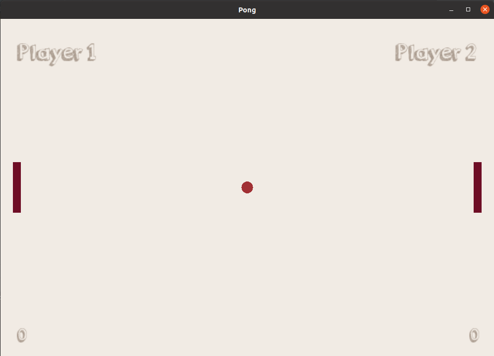

# Pong-Game
## Using SFML
* [McKucia](https://github.com/McKucia/)

### Description

Pong is a table tennis-themed arcade video game featuring simple two-dimensional graphics, manufactured by Atari and originally released in 1972. 

### Screenshots



### Libraries used in project

* SFML library for displaying objects and event handling.

Command to install library : ```sudo apt-get install libsfml-dev```

### How to run

1. Clone repository
2. Open build directory: ```cmake-build-debug```
3. Create cmake files: ```cmake ..```
4. Build repository: ```make```
5. Run prepared binary file of game: ```./Pong_sfml```

### Planned improvements

* Start screen
* Computer vs. Player mode
* Textures
* The ball should bounce at calculated angles
